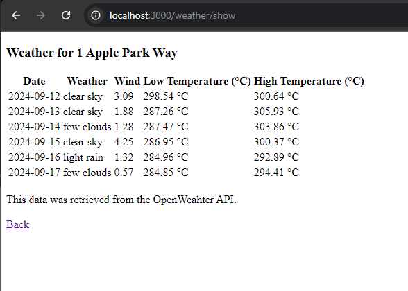

### About
Ruby on Rails application demonstrating weather API calls and caching.

Given an address, the weather data will be shown. The weather data is cached by zip code. UI will indicate when the cached data is used.

### Requirements: ([docs](./docs/requirements.txt))
* Google geolocation API key 
    * Place in `.env` like so:
    ```
    OPENWEATHER_API_KEY=<KEY>
    ```
* OpenWeather API key
* Caching - Using in-memory caching - No Redis dependency
* Chromedriver (when on WSL2, see [issues](#markdown-header-issues))

### How to run the rails server:
* Start with `rails server`

### How to run the test suite:
* `chromedriver # start the headless webdriver`
* `rails test:all # run all tests (system and unit)`
* `rspec # run rspec unit tests`

### How to use the app:
* Open `http://localhost:3000/` to access the address form
* Submit the form with your address
* A page with the weather data will be displayed


### What it looks like
Address form:


Displaying weather date from OpenWeather API



Displaying the cached data


### Environment Setup Issues:
This app was developed on Windows 10 WSL2 (Debian), requiring customizations that are generally not needed an OSX machine. 

Aside from the development environment setup, WSL2 needs a separate chromedriver for headless/integration testing, and the relevant configuration in the `aplication_system_test_case.rb`.

#### Chromedriver setup for WSL2

* Download chromedriver (https://googlechromelabs.github.io/chrome-for-testing/)
* Extract the downloaded archive, rename `chromedriver.exe` to `chromedriver` and make it an executable: `chmod 755 chromedriver`
* Update your shell (ex: `~/.zshrc`) `$PATH` to include the folder containing `chromedriver`
    * Example: `export PATH=$PATH:$HOME/chromedriver-win32`
* Run `chromedriver -v` to make sure it's in your path and that it runs
* Start `chromedriver --port=40000 --allow-ips`
    * Check both `Private` and `Public` networks on Windows firewall confirmation dialog box
    * Use `Windows Defender Firewall` to set/reset network options individually
* Update `./test/application_system_test_case.rb`: see [./test/application_system_test_case.rb](./test/application_system_test_case.rb)
